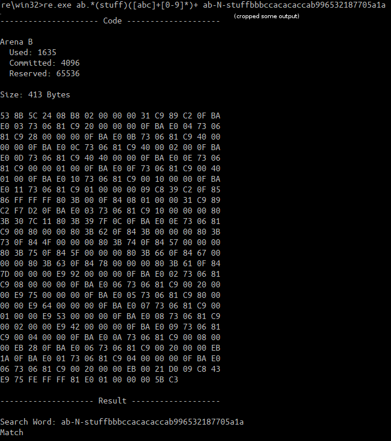

# dfre - Depth First Regular Expressions

Compiles a regular expression to 32 bit x86 assembly so the regex can be
evaluated on a search string by running the generated function in memory.

Normal regular expression engines work by first converting the regex string into
an [NFA](https://en.wikipedia.org/wiki/Nondeterministic_finite_automaton), then
interpreting that NFA using a simple virtual machine to execute it while looping
over the search string. This compiler skips the virtual machine and uses x86
instructions to execute the NFA on the CPU directly.

## Warning: Not prod ready

While I have functional tests, I can't guarantee that there are no horrible
memory security bugs. This code JIT compiles x86 and just runs it out of memory,
pretty much anything could happen.

Maybe someday in the future I can be more confident about security.

Currently dfre is only available as a commandline utility not a library.

## Regular Languages

This regular expression compiler only supports matching
[Regular Languages](https://en.wikipedia.org/wiki/Regular_language). This is a
deliberate limitation in order to allow for using an O(N) evaluation algorithm
(where N is the length of the search string) instead of being forced to use an
exponential-time algorithm, unlike some other "regex" engines \*cough\* PCRE
\*cough\*.

This is the intention of the name "regular expressions".

See also: [Regular Expression Matching Can Be Simple And Fast](http://swtch.com/~rsc/regexp/regexp1.html)

## Why

One day I was thinking about regular expressions and NFAs in the context of my
Automata and Formal Languages class. I also took Compilers and Algorithms at
nearly the same time and it synergized into a love of regex.

So I got it in my head that regex is basically a simplistic a programming
language that gets compiled to an NFA/DFA (since a compiler is any program that
translates from one machine language to another) which is a version of a turing
machine but with no memory. Then I realized that it should be possible to just
run the NFA directly on my x86 CPU since it is Turing machine which is a
superset.

To my surprise and delight, when I searched online for regex to machine code
compilers, I discovered that Ken Thompson had the same idea
[in 1968](http://www.oilshell.org/archive/Thompson-1968.pdf) and wrote a
regex compiler in Algol which produced IBX 7094 assembly
(https://doi.org/10.1145/363347.363387). I also found an
[article by Russ Cox](http://swtch.com/~rsc/regexp/regexp1.html) describing an
O(N) algorithm Thompson invented for evaluating an NFA, which is the algorithm I
used (although I used my own NFA gadget creation experience from class).

When I saw that Ken had the same idea I had to do a modern one in C and
producing x86. I wanted to share what I learned about regular expressions in
college and loved about it so much.

### Depth First

At the same time as I was taking these classes I was also getting into watching
Casey Muratori program on [Handmade Hero](handmadehero.org), a series of live
streams where he explains making an entire game from scratch. I learned a lot
about windows.h, learned how to use vim from watching him use emacs, and most
importantly his programming style rubbed off on me.

I became convinced that software can be much faster than it is and that the way
to fix it is to take control of the actual hardware and avoid abstraction
explosions. Taking control of the hardware means, among other things, knowing
the kind of performance it can really provide; being aware of memory caching,
page allocation, etc; and being very careful about when you allocate memory so
as to keep everything contiguous. Avoiding abstraction explosion means not
building any abstractions until you have a concrete use-case in mind and
designing those abstractions in such a way that they don't require any unneeded
work. All of this of course means no OOP, garbage collectors, or VM languages.

So I built this project partially as a proof-of-concept that this way of
thinking produces quality software. Depth First is my personal brand name for
this kind of project (the compiler doesn't do any depth first searches).

### No C Runtime Library

In keeping with the depth first idea, I wanted to minimize dependencies. I
realized I was only using a few syscalls anyway. Somehow I saw an article about
building one of these projects https://github.com/Francesco149/nolibc and I
randomly met the creator on Telegram. Using these projects as an example and
with help from Francesco I was able to make this project work without libc.

It was pretty fun, doesn't seem to make much of a difference. I kind of like
having errno as an in-band error instead of a global anyway. Now the binary is
very small.

Now I can REALLY say my project has absolutely no dependencies, it literally
links to 0 bytes of code that is not in this repository (although technically it
does depend on the platform kernels existing, that can be easily replaced for
bare-metal booting).

## Building

In the build/ directory there are folders for Linux, Windows, and MacOS. Run the
build script inside for your platform.

Only supports 32 bit binaries (but 64 bit OSs have compatibility modes)

##  License

This code is copyright (c) 2016-2017 Andrew Kallmeyer <fsmv@sapium.net> and 
provided under the MIT License. See the file LICENSE or https://mit-license.org
for the full text of the license.
